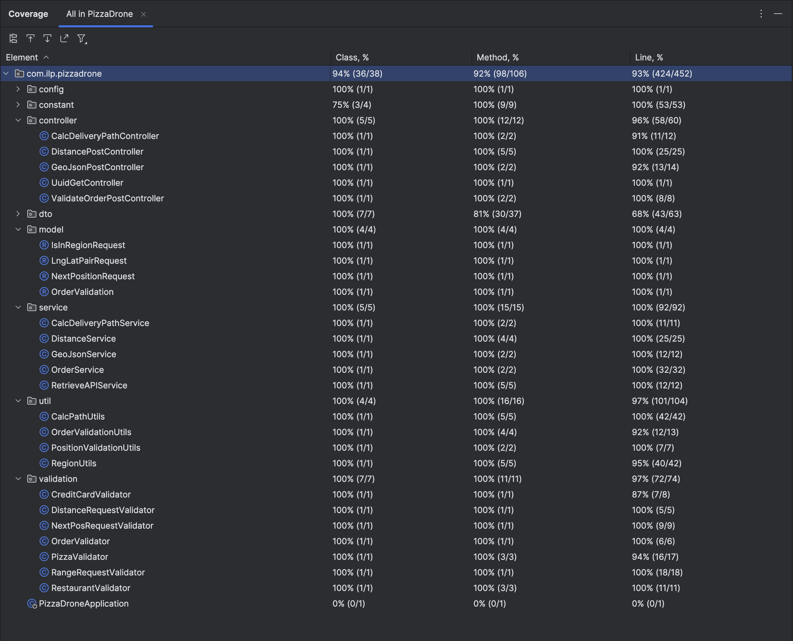

# Test Results & Coverage Report

## 1. Test Execution Summary
* **Total Tests:** 59
* **Pass Rate:** 100%
* **Failures:** 0
* **Execution Time:** 4 sec 960 ms

## 2. Test Coverage

As shown in the coverage report below, the testing strategy achieved high structural coverage in critical business logic packages.

## 3. Techniques

| Technique                    | Category              | Implementation Class            | Description of Application                                                               |
|:-----------------------------|:----------------------|:--------------------------------|:-----------------------------------------------------------------------------------------|
| **Partition Testing**        | Systematic Functional | `OrderValidationTest.java`      | Partitioned inputs into Valid (numeric) vs Invalid (non-numeric) based on specification. |
| **Boundary Value Analysis**  | Systematic Functional | `OrderValidationTest.java`      | Tested pizza counts at specification boundaries: 0 (Fail), 1 (Pass), 4 (Pass), 5 (Fail). |
| **Test Scaffolding**         | Structural            | `ValidateOrderServiceTest.java` | Used `Mockito` to isolate internal Service logic from external ILP dependencies.         |
| **Integration Testing**      | Structural            | `ValidateOrderPostTest.java`    | Verifies the structural integration of Controller components using `MockMvc`.            |